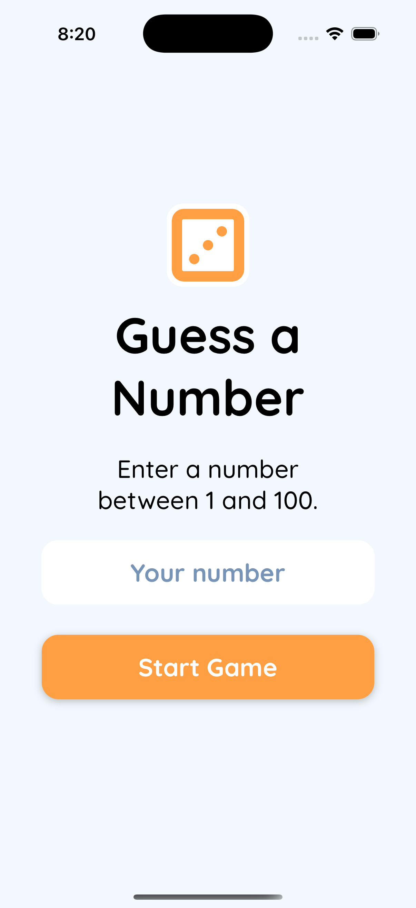
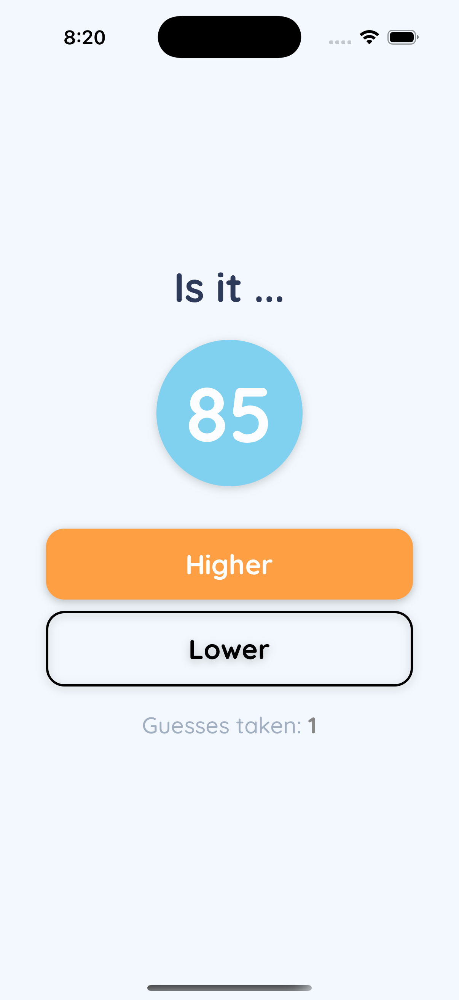
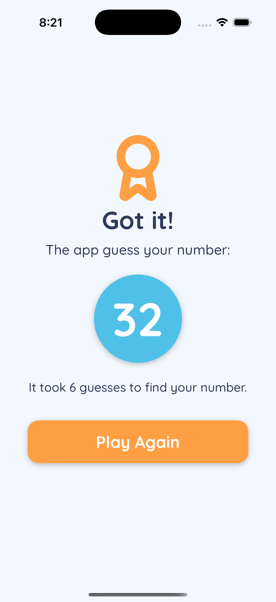
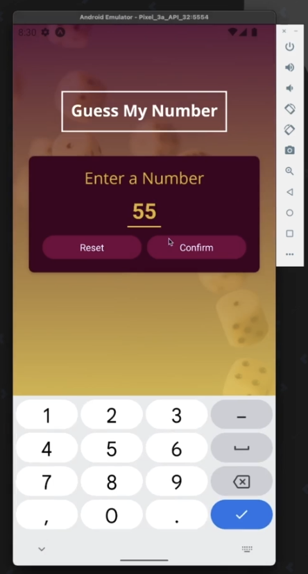
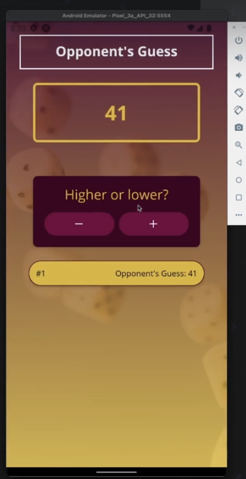

# React Native Number Guessing Game

A modern implementation of a number guessing game built with React Native, TypeScript, and Expo. This project is based on the [React Native - The Practical Guide [2025]](https://www.udemy.com/course/react-native-the-practical-guide/) course, but implemented with TypeScript and modern best practices.

## 🎮 Features

- Number guessing game with multiple rounds
- Beautiful and intuitive user interface
- Haptic feedback for better user experience
- Smooth animations and transitions
- Type-safe implementation with TypeScript
- Modern React Native architecture with Expo Router

## 📱 Screenshots

### My Version (TypeScript)

<table>
<tr>
<td></td>
<td></td>
<td></td>
</tr>
</table>

### Course Version (JavaScript)

<table>
<tr>
<td></td>
<td></td>
</tr>
</table>

## 🛠️ Tech Stack

- React Native 0.79.2
- TypeScript
- Expo SDK 53
- Expo Router for navigation
- React Native Reanimated for animations
- Expo Haptics for tactile feedback
- React Native Gesture Handler
- Safe Area Context for proper layout

## 🚀 Getting Started

### Prerequisites

- Node.js (LTS version)
- npm or yarn
- Expo CLI
- iOS Simulator (for Mac) or Android Emulator

### Installation

1. Clone the repository:

```bash
git clone https://github.com/yourusername/guess-game.git
cd guess-game
```

2. Install dependencies:

```bash
npm install
# or
yarn install
```

3. Start the development server:

```bash
npm start
# or
yarn start
```

4. Run on your preferred platform:

```bash
# For iOS
npm run ios
# For Android
npm run android
# For web
npm run web
```

## 📁 Project Structure

```
guess-game/
├── app/                    # Main application code
│   ├── _layout.tsx        # Root layout component
│   ├── index.tsx          # Home screen
│   ├── game.tsx           # Game screen
│   └── endgame.tsx        # End game screen
├── assets/                # Static assets
│   └── images/           # App screenshots and images
├── src/                   # Source code
└── package.json          # Project dependencies and scripts
```

## 🎯 Game Rules

1. The game generates a random number between 1 and 100
2. Players try to guess the number
3. After each guess, the game provides feedback (higher/lower)
4. The game tracks the number of attempts
5. Players can start a new game after completing a round
